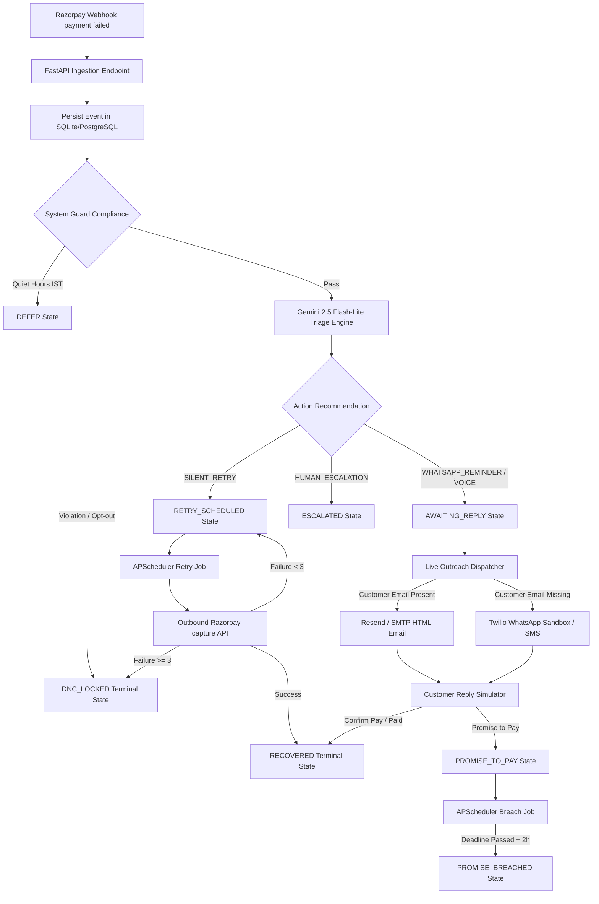
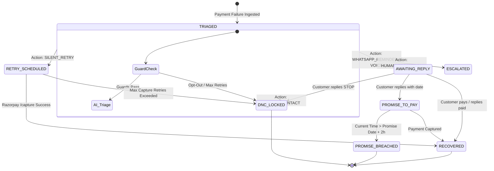

# RecoveryOS — AI-Driven Revenue Recovery Engine for Razorpay

RecoveryOS is an intelligent, cost-weighted revenue recovery orchestrator designed for Razorpay failed payment events. Instead of sending spammy alerts or blindly retrying transactions, RecoveryOS treats revenue recovery as a risk-weighted optimization problem, executing automated background workflows via a Finite State Machine (FSM) and maintaining an immutable audit ledger.

---

## 1. Problem Statement

Payment failures are the silent killers of digital business, costing merchants billions in lost revenue annually. 

* **High Transaction Churn**: In India's digital ecosystem, transaction failure rates on credit cards, UPI daily limits, and mandate bounces range from 15% to 35%. 
* **Generic, Dumb Outreach**: Traditional tools send static SMS alerts or emails at arbitrary intervals. This leads to user fatigue, high compliance risks (violating TRAI quiet hours), and customer opt-outs.
* **Gateways & Workflows Disconnect**: Most recovery "features" are passive dashboards or isolated state transitions. They do not trigger real API calls to payment gateways for captures, nor do they dispatch real outreach to customers in real time.
* **No Proven ROI**: Merchants cannot distinguish between "natural" recoveries (payments customers would have completed on their own) and recoveries driven by the AI engine.

### The RecoveryOS Solution
RecoveryOS replaces static rules with an **AI-driven decision loop**. It ingests payment failures in real time via webhooks, checks compliance constraints via a deterministic System Guard, uses **Gemini 2.5 Flash-Lite** to triage failures and generate personalized messages, dispatches live email/WhatsApp outreach, and automatically runs capture retries against Razorpay's API. Everything is measured against a counterfactual baseline to prove exact ROI.

---

## 2. Diagrams

### 2.1 System Architecture Diagram
The flowchart below illustrates the end-to-end processing pipeline, from webhook ingestion to FSM state updates and live dispatch.



---

### 2.2 Use Case Diagram
This diagram shows the interactions between the primary actors (Merchant, Customer, System Scheduler) and the RecoveryOS platform.

```mermaid
leftToRightDirection
graph TD
    subgraph Actors
        Merchant[Merchant Developer]
        Customer[Customer]
        Scheduler[System Scheduler]
    end

    subgraph "RecoveryOS Platform"
        UC1["Ingest Payment Webhook"]
        UC2["Run AI Triage & EV Score"]
        UC3["Enforce Trai quiet hours & limits"]
        UC4["Dispatch Outreach (Email/WhatsApp)"]
        UC5["Simulate Customer Reply"]
        UC6["Trigger Auto-Breach Check"]
        UC7["Trigger Razorpay API Capture Retry"]
        UC8["View Financial Net Gain & ROI"]
    end

    Merchant --> UC1
    Merchant --> UC8
    
    Scheduler --> UC6
    Scheduler --> UC7
    
    Customer --> UC4
    Customer --> UC5
    
    UC1 --> UC2
    UC2 --> UC3
    UC3 --> UC4
```

---

### 2.3 Finite State Machine (FSM) State Transitions
RecoveryOS governs payment lifecycles through a strict, auditable Finite State Machine. 



---

## 3. Environment Variables

Create a `.env` file in your `backend/` directory to configure the live APIs. If any keys are absent, the application gracefully defaults to simulated fallbacks.

| Variable Name | Required | Default / Fallback | Description |
|:---|:---:|:---|:---|
| `GEMINI_API_KEY` | No | Heuristic Engine | Google Gemini API key for structured event triage. |
| `GEMINI_MODEL` | No | `gemini-2.5-flash-lite` | Model name. Easily swappable to any Gemini tier. |
| `RESEND_API_KEY` | No | Simulation Mode | Resend.com API Key for dispatching rich HTML recovery emails. |
| `SMTP_HOST` | No | Simulation Mode | Alternative SMTP server host for sending email reminders. |
| `SMTP_PORT` | No | `587` | SMTP TLS Port. |
| `SMTP_USER` | No | None | SMTP username (e.g. Gmail address). |
| `SMTP_PASSWORD` | No | None | SMTP App Password. |
| `TWILIO_ACCOUNT_SID` | No | Simulation Mode | Twilio Account SID for WhatsApp/SMS fallback. |
| `TWILIO_AUTH_TOKEN` | No | Simulation Mode | Twilio Authentication Token. |
| `TWILIO_FROM_WHATSAPP` | No | `+14155238886` | Twilio WhatsApp Sandbox sender phone number. |
| `RAZORPAY_KEY_ID` | No | `rzp_test_RecoveryOS_DEMO` | Razorpay API Key ID (test or production). |
| `RAZORPAY_KEY_SECRET` | No | `RecoveryOS_DEMO_SECRET` | Razorpay API Key Secret. |

---

## 4. Setup & Installation

### Prerequisites
* Python 3.9+
* Node.js 18+

### 4.1 Backend Setup
1. Navigate to the backend folder:
   ```bash
   cd backend
   ```
2. Create and activate a virtual environment:
   ```bash
   python -m venv venv
   # On Windows:
   .\venv\Scripts\activate
   # On macOS/Linux:
   source venv/bin/activate
   ```
3. Install required packages:
   ```bash
   pip install -r requirements.txt
   ```
4. Start the FastAPI development server:
   ```bash
   python run.py
   ```
   The backend API will run at `http://127.0.0.1:8000`.

### 4.2 Frontend Setup
1. Navigate to the frontend folder:
   ```bash
   cd ../frontend
   ```
2. Install dependencies:
   ```bash
   npm install
   ```
3. Start the Vite development server:
   ```bash
   npm run dev
   ```
   The UI dashboard will run at `http://localhost:5173`.

---

## 5. Verification & Testing

Verify database migrations, API models, NLP date extraction, and scheduler logic by running the test suite:

```bash
python backend/test_fixes.py
```

### Tests Covered:
* `test_date_parser_nlp`: Parses phrases like "Pay on Friday" into future dates.
* `test_postgres_schema_compatibility`: Verifies schema loads properly with PostgreSQL `SERIAL PRIMARY KEY`.
* `test_scheduler_breach_detection`: Verifies background check transitions expired promises to `PROMISE_BREACHED`.
* `test_gemini_decision_engine_fallback_and_config`: Tests env configurations and heuristic fallbacks.
* `test_outreach_dispatcher_simulation_mode`: Asserts dispatcher handles missing API keys gracefully.
* `test_webhook_full_pipeline`: Simulates `/api/webhook/razorpay` to test the automated webhook-to-dispatch loop.
